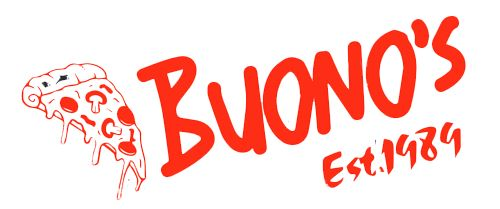

# Buonos_Pizzas

## Description
Buono’s Pizza is a family owned and operated pizza shop in Gilbert Arizona. As they are in the process of expanding by opening new pizza shops in the valley, they were in need of a modern website to manage the stores. Our task is to create a new design that will include some fun features and a way for customers to review the menu, order online, and get contact information or directions to a local store nearby.

## Table of Contents
- [Installation](#installation)
- [Usage](#usage)
- [Credits](#credits)
- [License](#license)
- [Badges](#badges)
- [Features](#features)
- [How To Contribute](#howtocontribute)

## Installation
Clone here at: https://github.com/pylabview/Buonos_Pizzas

Test here at: https://pylabview.github.io/Buonos_Pizzas/

## Usage
- As a customer I want to see the Buono’s pizza shop menu.
- As a customer I want to see Yelp reviews.
- As a customer I want to check the home team score(New York Yankees).
- As a customer I want to find directions to the store location. 
- As a customer I want to find contact information for the store.

## Credits
- Team roles were decided based on familiarity of tools for each team member. Then we assigned tasks based on that data. After a few start up meetings we broke our project into 4 major roles. 

 - Paloma was assigned the landing page index.html and supporting documents that may have been linked. She has also modified our local images using PhotoShop.

- Charbel was assigned to create card layouts and wire frames with BootStrap and CSS for previously mentioned API’s while creating connection points from JS to HTML.

- Rodrigo earned the role of Team Lead by managing the GitHub responsibilities, organizing team meet-times, and worked with dynamically creating Yelp reviews, as well as a precise map including data for stores that offer pizza in the local area. 
 
- Jeremiah was tasked with project manager.  This includes direct contact with the client to get feedback, additional requests, suggestions, or bug fixes during the project life cycle. Client feedback is important, so this information is then relayed to the team and we work closely to solve issues, clean up code, and merge results in GitHub. Finally, here we created the baseball API calls and gave it to the front end teams to display it. 

## License
GNU General Public License v3.0

https://github.com/pylabview/Buonos_Pizzas/blob/develop/LICENSE

## Badges 🏆

## Features

- Place for customers to find menu items.

- Way to find contact information.

- Place to find an about us story.

- View Yelp reviews.

- Find directions.

- Check MLB scores including (Yankees).

- Check local map to see ratings and local price.

- Play Buono's Pizza trivia.

- Use the hyperlinks to navigate to other pages or references:

- Use the buttons to see code work in action:

## How to Contribute
Find us inour Discord group!

https://discord.gg/KU7BNXZJ